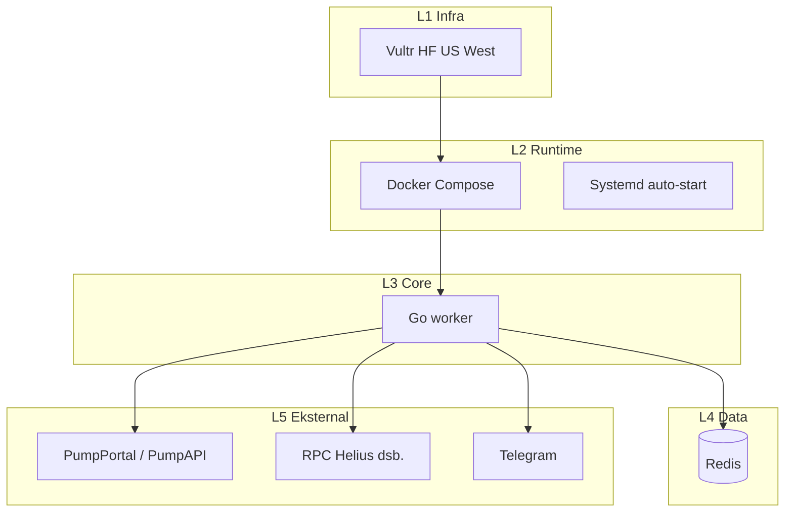

# RLANGGA full stack (final, end-to-end)

**Jenjang dokumen:** level 2 — turunan dari [rlangga-blueprint-v2.md](./rlangga-blueprint-v2.md)  
**Cakupan:** infrastruktur → runtime → data → observability → operasi  
**Status:** spesifikasi platform eksekusi siap produksi (bukan sekadar bot)

Dokumen ini menyatukan lapisan teknis end-to-end. Detail modul kode dan pohon repo ada di [rlangga-repo-structure.md](./rlangga-repo-structure.md). Aturan guard, kuota, dan jendela waktu tetap mengacu pada blueprint induk.

---

## 0. Ringkasan eksekutif

| Aspek | Arah |
|--------|------|
| **Tujuan** | Eksekusi latensi rendah + recovery deterministik + PnL terukur |
| **Inti** | Worker Go + Redis + API/RPC eksternal |
| **Mode** | Terkontainer (Docker), single-node dengan jalur scale horizontal |
| **Janji desain** | Platform eksekusi real-time + rekonsiliasi — dapat berjalan 24/7 |

---

## 1. Arsitektur tingkat tinggi



---

## 2. Stack berlapis

### L1 — Infra (compute)

| Properti | Nilai |
|----------|--------|
| Provider | Vultr |
| Tipe | High Frequency Compute |
| Region | Los Angeles / Silicon Valley |
| Spes | 2 vCPU / 4 GB RAM |
| Jaringan | Public IPv4 |

### L2 — Runtime

| Properti | Nilai |
|----------|--------|
| OS | Ubuntu 22.04 |
| Kontainer | Docker + Docker Compose |
| Auto-start | `systemd` (Docker enabled) |

### L3 — Core engine

| Properti | Nilai |
|----------|--------|
| Bahasa | Go |
| Pola | Event-driven + reconciliation loop |

| Modul | Fungsi |
|-------|--------|
| `app` | Worker loop |
| `executor` | Buy / sell |
| `rpc` | Validasi + scan wallet |
| `recovery` | Startup + loop |
| `exit` | Exit adaptif |
| `monitor` | Loop posisi |
| `pnl` | Perhitungan PnL |
| `store` | Trade log |
| `aggregate` | Metrik |
| `guard` | Kill switch / gate |
| `orchestrator` | Multi-bot |
| `lock` + `idempotency` | Keamanan operasi |

### L4 — Data layer (Redis)

| Penggunaan | Keterangan |
|------------|------------|
| Lock | Koordinasi posisi / mint |
| Idempotency | Cegah aksi ganda |
| State posisi (opsional) | `ACTIVE` / `EXITING` — cegah double sell; urutan BUY vs state — lihat [rlangga-production-hazards-and-fixes.md](./rlangga-production-hazards-and-fixes.md) §1–2 |
| Trade log | Append-only |
| Statistik | Loss, counter, agregat |

### L5 — Layanan eksternal

| Peran | Layanan |
|--------|---------|
| Eksekusi | PumpPortal (primer), PumpAPI (fallback) |
| Validasi | RPC (Helius direkomendasikan) |
| Alert | Telegram Bot API |

---

## 3. Docker stack (final)

```yaml
version: "3"

services:
  redis:
    image: redis:7
    restart: always

  worker:
    build: .
    restart: always
    depends_on:
      - redis
    environment:
      - REDIS_URL=redis:6379
      - RPC_URL=xxx
      - PUMPPORTAL_URL=xxx
```

Variabel tambahan (misalnya `PUMPAPI_URL`, secret Telegram) disesuaikan di deployment; jangan commit secret ke repositori.

---

## 4. Alur sistem inti

### Startup

1. Boot container  
2. Recovery scan (RPC)  
3. Force sell semua token (normalisasi state)  
4. Start listener (event)  
5. Start recovery loop berkelanjutan  

### Trade (happy path)

```text
event → lock → buy → tx → RPC confirm → monitor → exit → sell → RPC confirm
```

### Recovery loop

- **Interval:** 5–10 detik  
- Scan wallet  
- Jika token masih ada → **SELL paksa** (prioritas konsistensi state)  

---

## 5. Lapisan strategi (adaptive exit)

| Parameter | Nilai |
|-----------|--------|
| Panic SL | −8% |
| SL | −5% |
| TP | +7% |
| Momentum drop | 2–3% |
| Max hold | 15 s |

### Timing model

| Fase | Durasi | Makna |
|------|--------|--------|
| Noise | 0–2 s | Noise |
| Profit window | 3–10 s | Jendela profit |
| Decay risk | 10–20 s | Risiko peluruhan |

---

## 6. Analytics & reporting

| Komponen | Implementasi |
|----------|----------------|
| Trade log | Append-only di Redis |
| Metrik | Total trades, win rate, avg PnL, loss streak |

**Telegram**

- Ringkasan tiap N trade atau interval tetap (mis. tiap 5 trade)  
- Alert kill switch  

---

## 7. Kontrol risiko (guard)

| Mekanisme | Peran |
|-----------|--------|
| Daily loss limit | Batas kerugian harian |
| Balance minimum | Gate saldo |
| Kill switch | Hentikan buy / operasi berisiko |
| Trade gate | Izin/tolak entri |

**Perilaku umum**

- **Stop BUY** saat guard memblokir  
- **SELL tetap diizinkan** — sistem tetap hidup; fokus keluar dari posisi  

---

## 8. Self-healing

| Urutan | Langkah |
|--------|---------|
| 1 | VPS / host restart |
| 2 | Docker restart |
| 3 | Worker restart |
| 4 | Recovery scan |
| 5 | Posisi lama dijual / dinormalisasi |
| 6 | Operasi normal |

---

## 9. Scale multi-bot

| Aspek | Pola |
|--------|------|
| Instance | 2–4 worker |
| State bersama | Redis |
| Assignment | Round-robin (atau sesuai orchestrator) |
| Invariant | 1 mint = 1 posisi (lock) |

---

## 10. Strategi pengujian

| Lapisan | Fokus |
|---------|--------|
| Unit | Logika exit, perhitungan PnL |
| Simulasi | Kurva pump / skenario |
| Live | Modal kecil (mis. 0.1 SOL) |

---

## 11. Aturan keras (hard rules)

| Aturan | Alasan |
|--------|--------|
| Tanpa RPC → tidak ada kepercayaan state | Validasi wajib sebelum percaya tx |
| Tanpa recovery → sistem rusak | Rekonsiliasi wajib untuk invariant |
| Tanpa lock → chaos | Race multi-event / multi-bot |
| Tanpa retry → loss diam-diam | Sell dan path kritis harus diulang terkontrol |

---

## 12. Model operasi (fase)

| Fase | Skala | Tujuan |
|------|--------|--------|
| 1 | 1 bot | Validasi end-to-end |
| 2 | 2 bot | Baseline stabil |
| 3 | 3–4 bot | Scale throughput |

---

## 13. Cakupan kegagalan

| Kegagalan | Respons |
|-----------|---------|
| API gagal | Fallback (PumpAPI) |
| Tx gagal | Blok validasi / jangan lanjut sembarangan |
| Sell gagal | Retry |
| State mismatch | Masuk recovery loop |

---

## 14. Inti arsitektur

Sistem ini diposisikan sebagai **mesin eksekusi real-time + rekonsiliasi**, bukan label generik “bot” tanpa lapisan data, observability, dan operasi.

---

## Ringkasan stack

| Lapisan | Pilihan |
|---------|---------|
| Infra | Vultr US West (HF) |
| Runtime | Docker |
| Core | Go |
| Data | Redis |
| Eksekusi | PumpPortal (+ fallback) |
| Validasi | RPC |
| Alert | Telegram |

---

## Verifikasi desain (target)

| Kriteria | Target |
|----------|--------|
| Footprint | Minimal (single-node jelas) |
| Latensi | Rendah (path Go + Redis lokal) |
| Ketahanan | Tahan restart (recovery + SELL prioritas) |
| Scale | Horizontal via worker + Redis bersama |

---

*Untuk batasan governance (jam aktif, kuota harian, invariant posisi), gabungkan dokumen ini dengan [rlangga-blueprint-v2.md](./rlangga-blueprint-v2.md).*

*Race condition, quote basi, TTL lock, dan edge waktu: [rlangga-production-hazards-and-fixes.md](./rlangga-production-hazards-and-fixes.md).*

*Variabel lingkungan (satu kontrak): [rlangga-env-contract.md](./rlangga-env-contract.md).*

*Standar pengujian: [rlangga-test-standard.md](./rlangga-test-standard.md).*
